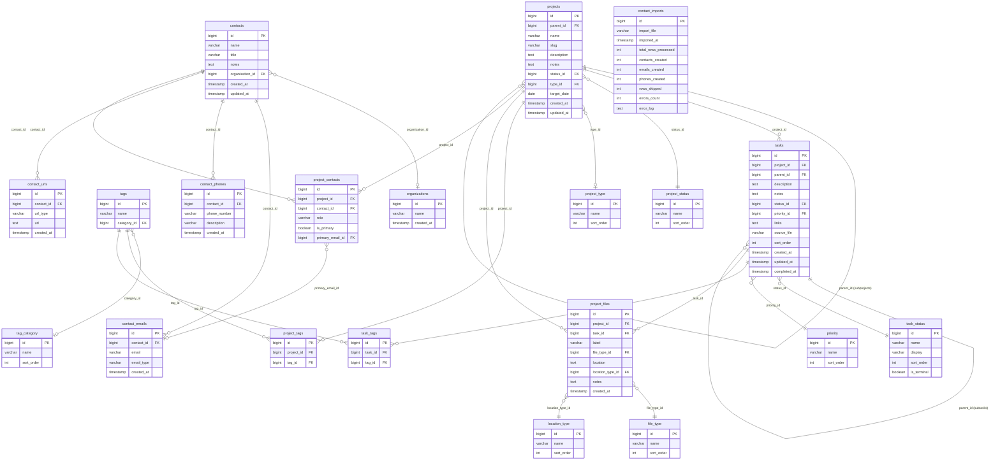

# Curator Database Reference

**Database:** `projects`  
**Host:** Steward LXC (`100.64.0.10`)  
**Engine:** PostgreSQL 15  
**Owner role:** `steward`  
**Last schema export:** April 2026

This document is the authoritative reference for the Curator database schema. It covers every table, view, index, and lookup value, with column-level purpose notes and design decision callouts. Use it when writing queries, debugging data issues, or onboarding to a new part of the codebase.

---

## Conventions

These rules apply uniformly across the entire schema. When something deviates, it's intentional and noted inline.

| Convention | Rule |
|---|---|
| Primary keys | `BIGINT GENERATED ALWAYS AS IDENTITY` on every table |
| Foreign key columns | `BIGINT` to match PKs — no `INT` mismatches |
| Timestamps | `created_at` and `updated_at` on every mutable table; `updated_at` maintained automatically by trigger |
| Trigger | `set_updated_at()` — a single shared plpgsql function applied to all mutable tables |
| Slugs | `VARCHAR(100) NOT NULL UNIQUE` — the stable, human-readable external handle; used in URLs and cross-references instead of raw IDs |
| Lookup table naming | Singular (`task_status`, `project_type`, not `task_statuses`) |
| Lookup table structure | Always: `id`, `name` (UNIQUE), `sort_order` (controls display order in menus) |
| Nullable | Columns are nullable unless there is a specific reason for NOT NULL — prefer explicit application-layer validation over schema coercion |
| SQL storage | Queries stored as literal SQL strings (not ORM shorthand) so they can be pasted directly into Adminer for debugging |

---

## Schema Map

| Table | Group | Purpose | Layer |
|---|---|---|---|
| `task_status` | Lookup | Valid task statuses | Original |
| `project_status` | Lookup | Valid project statuses | Original |
| `project_type` | Lookup | Project type categories | Original |
| `tag_category` | Lookup | Tag classification groups | Original |
| `location_type` | Lookup | File/URL location kinds | Original |
| `file_type` | Lookup | File content type classification | Original |
| `priority` | Lookup | Task priority levels | Original |
| `projects` | Core | Project records, self-referencing for subprojects | Original |
| `tasks` | Core | Task records, self-referencing for subtasks | Original |
| `tags` | Core | Flat tag list, optionally categorized | Original |
| `project_files` | Core | File/URL attachments for projects or tasks | Original |
| `project_tags` | Junction | Many-to-many: projects ↔ tags | Original |
| `task_tags` | Junction | Many-to-many: tasks ↔ tags | Original |
| `organizations` | Contacts | Employer/org records | April 2026 migration |
| `contacts` | Contacts | Person records | April 2026 migration |
| `contact_emails` | Contacts | Normalized email addresses per contact | April 2026 migration |
| `contact_phones` | Contacts | Normalized phone numbers per contact | April 2026 migration |
| `contact_urls` | Contacts | URLs per contact (LinkedIn, GitHub, etc.) | April 2026 migration |
| `project_contacts` | Junction/Contacts | Many-to-many: projects ↔ contacts, with role payload | April 2026 migration |
| `contact_imports` | Audit | Import run audit log (contactkit) | April 2026 migration |

---

## Planned Schema Changes

### `project_type_status` — Status filtering by project type

**Problem:** The `project_status` lookup table contains statuses that only make sense for certain project types. For example, `Published`, `Ready to Write`, and `Queued` are meaningful for a blogging project but nonsensical for a coding or homelab project. Currently the full status list appears in all project forms regardless of type.

**Solution:** A junction table mapping which statuses are valid for which project types. The UI filters the status dropdown based on the selected project type.

Proposed table:

```sql
CREATE TABLE project_type_status (
    id              BIGINT NOT NULL GENERATED ALWAYS AS IDENTITY PRIMARY KEY,
    project_type_id BIGINT NOT NULL REFERENCES project_type(id) ON DELETE CASCADE,
    project_status_id BIGINT NOT NULL REFERENCES project_status(id) ON DELETE CASCADE,
    CONSTRAINT uq_project_type_status UNIQUE (project_type_id, project_status_id)
);
```

A project type with no rows in this table would show all statuses (safe default for existing types until mappings are defined). The UI query would be something like:

```sql
-- Statuses valid for a given project type
SELECT ps.id, ps.name, ps.sort_order
FROM project_status ps
JOIN project_type_status pts ON pts.project_status_id = ps.id
WHERE pts.project_type_id = <type_id>
ORDER BY ps.sort_order;
```

**Dependencies:** Requires the status consistency fix first — all forms must be pulling status from the lookup table before type-filtering is added on top.

**Status:** Not yet implemented. Design decision recorded here for reference.

---

## Lookup Tables

Lookup tables are small, stable, and seeded once. The `name` column is what the application reads and writes — no ID-to-name translation layer is needed in application code. The `sort_order` column controls display sequence in menus and dropdowns.

### `task_status`

Valid statuses for tasks. The `name` values match `VALID_STATUSES` in the legacy `todo.py` tool exactly — this was a deliberate compatibility decision.

| id | name | display | sort_order | is_terminal |
|---|---|---|---|---|
| 1 | open | `[ ]` | 1 | false |
| 2 | in progress | `[~]` | 2 | false |
| 3 | on hold | `[!]` | 3 | false |
| 4 | complete | `[x]` | 4 | **true** |

**Special columns:**
- `display` — single-character CLI marker inherited from todo.py; used in text-mode views
- `is_terminal` — `TRUE` means no further status changes are expected; used by `v_projects` to compute `completed_tasks` vs `open_tasks` counts. Currently only `complete` is terminal.

### `project_status`

Valid statuses for projects. The original four seed values cover the standard project lifecycle. Four additional values were added manually for a blogging/writing project type.

| id | name | sort_order |
|---|---|---|
| 1 | active | 1 |
| 2 | paused | 2 |
| 3 | completed | 3 |
| 4 | abandoned | 4 |
| 5 | Published | 10 |
| 6 | Ready to Write | 20 |
| 7 | In Progress | 30 |
| 8 | Queued | 40 |

> **Note:** IDs 5–8 were added after initial seed and have higher `sort_order` values, placing them after the core lifecycle statuses in menus. The `seed.sql` file does not yet include these values and will need to be updated.

### `project_type`

| id | name | sort_order |
|---|---|---|
| 1 | coding | 1 |
| 2 | homelab | 2 |
| 3 | game-dev | 3 |
| 4 | personal | 4 |
| 5 | Job Application | 5 |
| 6 | other | 6 |

> **Note:** `Job Application` uses title case (capitalized) — intentional, matches how it's displayed in the job hunt workflow.

### `tag_category`

Groups tags by kind. Used by the UI to cluster tags in displays.

| id | name | sort_order | Typical use |
|---|---|---|---|
| 1 | component | 1 | Named subsystem: `project-crew`, `doc-gen`, `dbkit` |
| 2 | technology | 2 | Language or platform: `python`, `postgres`, `docker` |
| 3 | area | 3 | Broad domain: `networking`, `job-search`, `homelab` |
| 4 | skill | 4 | Competency being developed or demonstrated |

### `location_type`

Classifies the storage location of a `project_files` entry.

| id | name | sort_order |
|---|---|---|
| 1 | local | 1 |
| 2 | url | 2 |
| 3 | git | 3 |
| 4 | s3 | 4 |

### `file_type`

Classifies the content kind of a `project_files` entry.

| id | name | sort_order |
|---|---|---|
| 1 | markdown | 1 |
| 2 | config | 2 |
| 3 | script | 3 |
| 4 | log | 4 |
| 5 | json | 5 |
| 6 | yaml | 6 |
| 7 | other | 7 |

### `priority`

Task priority levels, in ascending severity order.

| id | name | sort_order |
|---|---|---|
| 1 | low | 1 |
| 2 | normal | 2 |
| 3 | high | 3 |
| 4 | blocking | 4 |

---

## Core Tables

### `projects`

The central entity. Projects are self-referencing — a project with `parent_id IS NULL` is a top-level project; a project with a `parent_id` is a subproject. Nesting is unlimited.

| Column | Type | Nullable | Notes |
|---|---|---|---|
| `id` | BIGINT | NOT NULL | PK, identity |
| `parent_id` | BIGINT | nullable | FK → `projects(id)` ON DELETE SET NULL. NULL = top-level project. |
| `name` | VARCHAR(255) | NOT NULL | Display name |
| `slug` | VARCHAR(100) | NOT NULL UNIQUE | Stable URL handle. Used in all routes and cross-references. |
| `description` | TEXT | nullable | Free-text project summary |
| `notes` | TEXT | nullable | Free-form working notes; displayed and editable in the board panel |
| `status_id` | BIGINT | NOT NULL | FK → `project_status(id)` |
| `type_id` | BIGINT | nullable | FK → `project_type(id)` |
| `target_date` | DATE | nullable | Optional target completion date |
| `created_at` | TIMESTAMP | NOT NULL | Defaults to `NOW()` |
| `updated_at` | TIMESTAMP | NOT NULL | Maintained by `trg_projects_updated_at` trigger |

**Deletion:** Deleting a project cascades to `tasks`, `project_tags`, `project_files`, and `project_contacts`. The parent project is not deleted when a subproject is deleted — `parent_id` is set to NULL instead (`ON DELETE SET NULL`).

**Indexes:** `idx_projects_parent` (parent_id), `idx_projects_status` (status_id), `idx_projects_type` (type_id)

---

### `tasks`

Tasks belong to a project and can have subtasks. `project_id` is stored on every row (including subtasks) for query simplicity — the application enforces that subtasks inherit the same `project_id` as their parent on insert.

| Column | Type | Nullable | Notes |
|---|---|---|---|
| `id` | BIGINT | NOT NULL | PK, identity |
| `project_id` | BIGINT | NOT NULL | FK → `projects(id)` ON DELETE CASCADE |
| `parent_id` | BIGINT | nullable | FK → `tasks(id)` ON DELETE NO ACTION. NULL = top-level task. |
| `description` | TEXT | NOT NULL | The task text |
| `notes` | TEXT | nullable | Free-form working notes |
| `status_id` | BIGINT | NOT NULL | FK → `task_status(id)` |
| `priority_id` | BIGINT | NOT NULL | FK → `priority(id)` |
| `links` | TEXT | NOT NULL | Comma-separated URLs. Defaults to `''`. Inherited from todo.py storage format. |
| `source_file` | VARCHAR(255) | NOT NULL | Which markdown/json file the task was imported from, if any. Defaults to `''`. |
| `sort_order` | INT | NOT NULL | Display order within a project. Defaults to 0. |
| `created_at` | TIMESTAMP | NOT NULL | Defaults to `NOW()` |
| `updated_at` | TIMESTAMP | NOT NULL | Maintained by `trg_tasks_updated_at` trigger |
| `completed_at` | TIMESTAMP | nullable | Set when status transitions to a terminal status |

**Deletion rules (important):**
- `project_id ON DELETE CASCADE` — deleting a project deletes all its tasks and their subtasks automatically
- `parent_id ON DELETE NO ACTION` — the application must detect child tasks, present a double-confirmation, and delete children before the parent. The database will reject a delete of a parent task that still has children.

**Indexes:** `idx_tasks_project` (project_id), `idx_tasks_parent` (parent_id), `idx_tasks_status` (status_id), `idx_tasks_priority` (priority_id)

---

### `tags`

A flat list of tags, optionally assigned to a category. Tags themselves have no project or task context — that lives in the junction tables.

| Column | Type | Nullable | Notes |
|---|---|---|---|
| `id` | BIGINT | NOT NULL | PK, identity |
| `name` | VARCHAR(100) | NOT NULL UNIQUE | Tag label |
| `category_id` | BIGINT | nullable | FK → `tag_category(id)`. NULL = uncategorized. |

**Indexes:** `idx_tags_category` (category_id)

---

### `project_files`

Attaches file paths or URLs to a project or a task. At least one of `project_id` or `task_id` must be set — a CHECK constraint enforces this.

| Column | Type | Nullable | Notes |
|---|---|---|---|
| `id` | BIGINT | NOT NULL | PK, identity |
| `project_id` | BIGINT | nullable | FK → `projects(id)` ON DELETE CASCADE |
| `task_id` | BIGINT | nullable | FK → `tasks(id)` ON DELETE CASCADE |
| `label` | VARCHAR(255) | NOT NULL | Human-readable name for the attachment (e.g., "source repo", "todo list") |
| `file_type_id` | BIGINT | NOT NULL | FK → `file_type(id)` |
| `location` | TEXT | NOT NULL | The path or URL |
| `location_type_id` | BIGINT | NOT NULL | FK → `location_type(id)` |
| `notes` | TEXT | nullable | Optional annotation |
| `created_at` | TIMESTAMP | NOT NULL | Defaults to `NOW()` |

**Constraint:** `CHECK (project_id IS NOT NULL OR task_id IS NOT NULL)` — one or both must be set; neither alone can be null.

**No `updated_at`:** `project_files` is append-only in the current implementation. There is no trigger on this table.

**Indexes:** `idx_project_files_project` (project_id), `idx_project_files_task` (task_id)

---

## Junction Tables

### `project_tags`

| Column | Type | Notes |
|---|---|---|
| `id` | BIGINT | PK, identity |
| `project_id` | BIGINT | FK → `projects(id)` ON DELETE CASCADE |
| `tag_id` | BIGINT | FK → `tags(id)` ON DELETE CASCADE |

Unique constraint: `uq_project_tags (project_id, tag_id)`

### `task_tags`

| Column | Type | Notes |
|---|---|---|
| `id` | BIGINT | PK, identity |
| `task_id` | BIGINT | FK → `tasks(id)` ON DELETE CASCADE |
| `tag_id` | BIGINT | FK → `tags(id)` ON DELETE CASCADE |

Unique constraint: `uq_task_tags (task_id, tag_id)`

---

## Contacts Tables

The contacts schema was added in April 2026 via migration (not part of the original `schema.sql`/`seed.sql`). All tables exist in the live database. No routes or UI have been built yet — contactkit (the import tool) will populate these tables first; the Curator UI will follow.

> **Note:** `seed.sql` does not include these tables. When `seed.sql` is eventually updated, these tables will need `CREATE TABLE` and `CREATE INDEX` statements added. There is no seed data for contacts — `organizations` is populated by the application, not seeded.

### `organizations`

Employer or organization records. Referenced by contacts.

| Column | Type | Nullable | Notes |
|---|---|---|---|
| `id` | BIGINT | NOT NULL | PK, identity |
| `name` | VARCHAR(255) | NOT NULL UNIQUE | Organization name |
| `created_at` | TIMESTAMP | NOT NULL | Defaults to `NOW()` |

**No `updated_at`:** Organization names are treated as stable identifiers. The unique constraint on `name` prevents duplicates.

**Indexes:** `idx_organizations_name` (name)

---

### `contacts`

Person records. A contact exists independently of any project — the project relationship lives in `project_contacts`.

| Column | Type | Nullable | Notes |
|---|---|---|---|
| `id` | BIGINT | NOT NULL | PK, identity |
| `name` | VARCHAR(255) | nullable | Person's name. Nullable to allow phone/email-only import records. |
| `title` | VARCHAR(100) | nullable | Job title |
| `notes` | TEXT | nullable | Free-form notes about the person |
| `organization_id` | BIGINT | nullable | FK → `organizations(id)` ON DELETE SET NULL |
| `created_at` | TIMESTAMP | NOT NULL | Defaults to `NOW()` |
| `updated_at` | TIMESTAMP | NOT NULL | Maintained by `trg_contacts_updated_at` trigger |

**Design decisions:**
- All fields except `id` and timestamps are nullable — allows importing partial records from CSV exports where not all fields are present
- The `email` column that existed in the original contacts design was dropped during the April 2026 migration; emails now live in `contact_emails` (normalized)
- Role and `is_primary` belong in `project_contacts`, not here — a person can have different roles on different projects

**Indexes:** `idx_contacts_organization` (organization_id)

---

### `contact_emails`

Normalized email addresses. A contact can have multiple emails, each with an optional type label.

| Column | Type | Nullable | Notes |
|---|---|---|---|
| `id` | BIGINT | NOT NULL | PK, identity |
| `contact_id` | BIGINT | NOT NULL | FK → `contacts(id)` ON DELETE CASCADE |
| `email` | VARCHAR(255) | nullable | Email address. Nullable because Gmail CSV exports can contain empty email fields. |
| `email_type` | VARCHAR(50) | nullable | Free-text type label (e.g., "home", "work"). Not a lookup table. |
| `created_at` | TIMESTAMP | NOT NULL | Defaults to `NOW()` |

**Indexes:** `idx_contact_emails_contact` (contact_id), `idx_contact_emails_email` (email)

---

### `contact_phones`

Normalized phone numbers. A contact can have multiple phone numbers.

| Column | Type | Nullable | Notes |
|---|---|---|---|
| `id` | BIGINT | NOT NULL | PK, identity |
| `contact_id` | BIGINT | NOT NULL | FK → `contacts(id)` ON DELETE CASCADE |
| `phone_number` | VARCHAR(50) | NOT NULL | |
| `description` | VARCHAR(100) | nullable | Free-text label (e.g., "mobile", "office") |
| `created_at` | TIMESTAMP | NOT NULL | Defaults to `NOW()` |

**Indexes:** `idx_contact_phones_contact` (contact_id)

---

### `contact_urls`

URLs associated with a contact — LinkedIn, GitHub, portfolio, etc.

| Column | Type | Nullable | Notes |
|---|---|---|---|
| `id` | BIGINT | NOT NULL | PK, identity |
| `contact_id` | BIGINT | NOT NULL | FK → `contacts(id)` ON DELETE CASCADE |
| `url_type` | VARCHAR(50) | nullable | Free-text label (e.g., "linkedin", "github") |
| `url` | TEXT | NOT NULL | |
| `created_at` | TIMESTAMP | NOT NULL | Defaults to `NOW()` |

**Indexes:** `idx_contact_urls_contact` (contact_id)

---

### `project_contacts`

Many-to-many junction between projects and contacts. Carries a role payload because a person's role is project-context-dependent — the same person can be a "hiring manager" on one project and a "technical reference" on another.

| Column | Type | Nullable | Notes |
|---|---|---|---|
| `id` | BIGINT | NOT NULL | PK, identity |
| `project_id` | BIGINT | NOT NULL | FK → `projects(id)` ON DELETE CASCADE |
| `contact_id` | BIGINT | NOT NULL | FK → `contacts(id)` ON DELETE CASCADE |
| `role` | VARCHAR(100) | nullable | Role in this project context (e.g., "hiring manager", "recruiter") |
| `is_primary` | BOOLEAN | NOT NULL | Whether this is the primary contact for the project. Defaults to `false`. |
| `primary_email_id` | BIGINT | nullable | FK → `contact_emails(id)` ON DELETE SET NULL. Which email to use for this project — context-dependent because a contact may have work and personal emails and the preferred one differs by project. |

Unique constraint: `uq_project_contacts (project_id, contact_id)`

**Indexes:** `idx_project_contacts_project` (project_id), `idx_project_contacts_contact` (contact_id), `idx_project_contacts_primary_email` (primary_email_id)

---

### `contact_imports`

Audit log written by contactkit at the end of each import run. One row per import.

| Column | Type | Nullable | Notes |
|---|---|---|---|
| `id` | BIGINT | NOT NULL | PK, identity |
| `import_file` | VARCHAR(255) | nullable | Source filename |
| `imported_at` | TIMESTAMP | NOT NULL | Defaults to `NOW()` |
| `total_rows_processed` | INT | nullable | Rows read from the import file |
| `contacts_created` | INT | nullable | New contact records inserted |
| `emails_created` | INT | nullable | New `contact_emails` rows inserted |
| `phones_created` | INT | nullable | New `contact_phones` rows inserted |
| `rows_skipped` | INT | nullable | Rows skipped (duplicates, bad format, etc.) |
| `errors_count` | INT | nullable | Number of errors encountered |
| `error_log` | TEXT | nullable | Full error detail for failed rows |

**Indexes:** `idx_contact_imports_imported_at` (imported_at DESC)

---

## Views

Views join lookup names back in so repository queries don't need additional joins for display. Always prefer querying views over base tables for read operations in application code.

### `v_projects`

Flat project view with all FK values resolved to human-readable names, parent context, and task counts. This is the primary view for project listings and the board panel.

**Columns:** `id`, `parent_id`, `parent_name`, `parent_slug`, `name`, `slug`, `description`, `notes`, `status`, `project_type`, `target_date`, `created_at`, `updated_at`, `total_tasks`, `completed_tasks`, `open_tasks`

**Task count behavior:**
- `total_tasks` — all tasks with `project_id = p.id`
- `completed_tasks` — tasks where `task_status.is_terminal = TRUE`
- `open_tasks` — tasks where `task_status.is_terminal = FALSE`
- Counts reflect **direct project tasks only** — subtasks (tasks with a non-null `parent_id`) are included if their `project_id` matches, because `project_id` is stored denormalized on every task row

---

### `v_tasks`

Task view with status name, priority name, and parent task context resolved. Used for task listings and the board panel task section.

**Columns:** `id`, `project_id`, `project_name`, `project_slug`, `parent_id`, `parent_description`, `description`, `notes`, `status`, `status_display`, `is_terminal`, `priority`, `links`, `source_file`, `sort_order`, `created_at`, `updated_at`, `completed_at`

**Note:** `parent_description` is the description text of the parent task (via LEFT JOIN on `tasks`). Null for top-level tasks.

---

### `v_project_tree`

Recursive CTE that expands the full project ancestry. Useful for building tree displays and path breadcrumbs.

**Columns:** `id`, `parent_id`, `name`, `slug`, `depth`, `path`

- `depth` — 0 = top-level project, 1 = direct subproject, etc.
- `path` — `VARCHAR[]` array of slugs from root to current node (e.g., `{project-crew, project-crew-todo}`)

---

### `v_task_tree`

Recursive CTE that expands full subtask ancestry. Carries `project_id` and `project_slug` through every level so the tree can be filtered by project without additional joins.

**Columns:** `id`, `parent_id`, `project_id`, `project_slug`, `description`, `status`, `is_terminal`, `priority`, `sort_order`, `depth`, `path`

- `depth` — 0 = top-level task (parent_id IS NULL)
- `path` — `BIGINT[]` array of task IDs from root to current node

---

## Indexes Summary

| Index | Table | Column(s) | Purpose |
|---|---|---|---|
| `idx_projects_parent` | projects | parent_id | Subproject lookups and tree traversal |
| `idx_projects_status` | projects | status_id | Filtering by status |
| `idx_projects_type` | projects | type_id | Filtering by type |
| `idx_tasks_project` | tasks | project_id | Primary task-by-project lookup |
| `idx_tasks_parent` | tasks | parent_id | Subtask lookups and tree traversal |
| `idx_tasks_status` | tasks | status_id | Filtering by status |
| `idx_tasks_priority` | tasks | priority_id | Filtering by priority |
| `idx_tags_category` | tags | category_id | Tag display grouped by category |
| `idx_project_files_project` | project_files | project_id | File lookups by project |
| `idx_project_files_task` | project_files | task_id | File lookups by task |
| `idx_organizations_name` | organizations | name | Organization lookup by name |
| `idx_contacts_organization` | contacts | organization_id | Contacts by organization |
| `idx_contact_emails_contact` | contact_emails | contact_id | Emails for a contact |
| `idx_contact_emails_email` | contact_emails | email | Email address lookup |
| `idx_contact_phones_contact` | contact_phones | contact_id | Phones for a contact |
| `idx_contact_urls_contact` | contact_urls | contact_id | URLs for a contact |
| `idx_project_contacts_project` | project_contacts | project_id | Contacts for a project |
| `idx_project_contacts_contact` | project_contacts | contact_id | Projects for a contact |
| `idx_project_contacts_primary_email` | project_contacts | primary_email_id | Primary email FK integrity |
| `idx_contact_imports_imported_at` | contact_imports | imported_at DESC | Recent imports first |

---

## ER Diagram



---

## Useful Query Patterns

These queries are Adminer-ready — paste them directly into the SQL box.

### All active projects (top-level only)

```sql
SELECT id, name, slug, status, total_tasks, open_tasks, completed_tasks
FROM v_projects
WHERE status = 'active'
  AND parent_id IS NULL
ORDER BY name;
```

### All projects including subprojects, with parent context

```sql
SELECT id, name, slug, parent_name, status, project_type, total_tasks, open_tasks
FROM v_projects
ORDER BY parent_name NULLS FIRST, name;
```

### Tasks for a specific project (top-level tasks only)

```sql
SELECT id, description, status, priority, sort_order, updated_at
FROM v_tasks
WHERE project_slug = 'your-slug-here'
  AND parent_id IS NULL
ORDER BY sort_order, created_at;
```

### Tasks for a project including subtasks, with depth

```sql
SELECT id, description, status, priority, depth, path
FROM v_task_tree
WHERE project_slug = 'your-slug-here'
ORDER BY path;
```

### Full project tree (all projects with depth and ancestry path)

```sql
SELECT id, name, slug, depth, path
FROM v_project_tree
ORDER BY path;
```

### Contacts for a project

```sql
SELECT
    c.id,
    c.name,
    c.title,
    o.name AS organization,
    pc.role,
    pc.is_primary,
    ce.email AS primary_email
FROM project_contacts pc
JOIN contacts c ON c.id = pc.contact_id
LEFT JOIN organizations o ON o.id = c.organization_id
LEFT JOIN contact_emails ce ON ce.id = pc.primary_email_id
WHERE pc.project_id = (SELECT id FROM projects WHERE slug = 'your-slug-here')
ORDER BY pc.is_primary DESC, c.name;
```

### All emails for a contact

```sql
SELECT email, email_type
FROM contact_emails
WHERE contact_id = <contact_id>
ORDER BY email_type NULLS LAST;
```

### Recent import audit log

```sql
SELECT import_file, imported_at, contacts_created, emails_created,
       rows_skipped, errors_count
FROM contact_imports
ORDER BY imported_at DESC
LIMIT 10;
```

---

## Database Reset Procedure

To fully reset the database (drops everything, recreates schema, loads seed data):

```bash
psql -h 100.64.0.10 -U steward -d projects -f schema.sql
psql -h 100.64.0.10 -U steward -d projects -f seed.sql
```

> **Warning:** The contacts tables (`organizations`, `contacts`, `contact_emails`, `contact_phones`, `contact_urls`, `project_contacts`, `contact_imports`) are not yet in `schema.sql` or `seed.sql`. Running a full reset will drop them. After a reset, the April 2026 migration script (`SCHEMA_MIGRATION_CONTACTS.md`) must be re-run to restore them.
>
> This is a known gap — updating `schema.sql` and `seed.sql` to include the contacts tables is a tracked backlog item.
